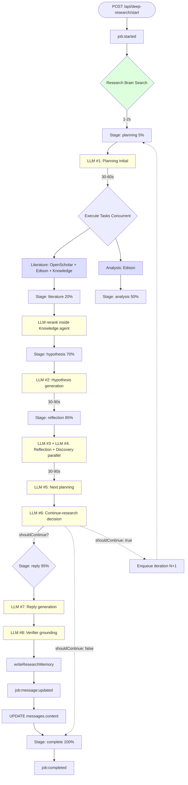

# BioAgents Deep-Research — Análisis End-to-End

> Análisis completo del flujo de una consulta deep-research. Mide tiempos reales del job `569f499a` (anthoteibinenes), mapea cada llamada a LLM, evalúa calidad y propone telemetría enriquecida para la UI.

## TL;DR

- **Job real medido**: `569f499a` ("IC50 of anthoteibinenes against C. albicans"), 2 iteraciones, **17m 14s total**
- **6 agentes ejecutan ~9 llamadas a LLM** por job (planning initial, literature ×3 paths, hypothesis, reflection, discovery, continue-research, next-planning, reply + verifier)
- **Calidad**: el reply final (3350 chars) cita el paper correcto `marinedrugs-23-00044.pdf` con DOI, IC50 exacto, snippets verbatim y SAR insights
- **Gaps de telemetría**: hay 24 eventos emitidos vía Redis pub/sub, pero la UI solo consume 6 de ellos
- **Propuesta**: agregar 4 eventos granulares + stage-based progress para streaming real-time

---

## 1. Job medido (ground truth)

**Job ID**: `569f499a-b697-4b38-a58f-9a7500eee79e`
**Conversación**: `0a77ab29-eab2-4603-8f98-0ad92726aa30`
**Query**: "What are the IC50 values of anthoteibinenes against Candida albicans?"
**Model**: `minimax/minimax-m3` (vía OpenRouter, $0.111 USD total)
**Started**: 2026-06-18 08:14:12 UTC
**Completed**: 2026-06-18 08:23:58 UTC
**Iteraciones**: 2

### Mensajes generados

| Msg | created_at | response_time | content_len | summary |
|---|---|---|---|---|
| 569f499a | 08:14:12 | 584,684 ms (9m 44s) | 3057 chars | "anthoteibinenes I and J demonstrated measurable activity against C. albicans..." |
| 50e40634 | 08:23:58 | 449,677 ms (7m 30s) | 3350 chars | "Only anthoteibinene J demonstrates quantifiable antifungal activity, IC50 7.0 μg/mL" |

**Total wall-clock**: 17m 14s (entre el primer `started` y el último `completed`)

---

## 2. Flujo completo por iteración

Cada iteración del worker ejecuta este flow (`src/services/queue/workers/deep-research.worker.ts:64-1199`):

```
┌────────────────────────────────────────────────────────────────────────┐
│ ITERACIÓN 1 (9m 44s)                                                  │
├────────────────────────────────────────────────────────────────────────┤
│                                                                        │
│ 1. ENQUEUE (0s)                                                       │
│    └─ notifyJobStarted → jobId, conversationId, messageId             │
│                                                                        │
│ 2. RESEARCH BRAIN SEARCH (1-2s)                                       │
│    └─ researchBrainSearch() — Postgres + vector search                │
│       eventos: deep_research_job_started, starting_iteration          │
│       progress: stage="planning" percent=5                            │
│                                                                        │
│ 3. PLANNING AGENT "initial" (32s)                                     │
│    └─ planningAgent(mode="initial")                                  │
│       ├─ LLM call #1: planning initial                               │
│       │  prompt: INITIAL_PLANNING_NO_PLAN_PROMPT                      │
│       │  input: user query + context + research mode guidance         │
│       │  output: { plan: PlanTask[], currentObjective }               │
│       │  model: minimax/minimax-m3                                   │
│       └─ Persiste plan en conversation_states                        │
│    eventos: deep_research_job_planning, planning_json_extraction,     │
│             initial_plan_generated, new_tasks_added_to_plan,         │
│             deep_research_job_planning_completed                      │
│    progress: stage="planning" percent=5                               │
│                                                                        │
│ 4. TASK EXECUTION (literature + analysis concurrent) (3-4s)          │
│    Si task.type === "LITERATURE":                                    │
│      ├─ OpenScholar literatureAgent (si OPENSCHOLAR_API_URL)         │
│      ├─ Edison/BioLit literatureAgent (primary, always)              │
│      └─ Knowledge base literatureAgent (si KNOWLEDGE_DOCS_PATH)      │
│    Si task.type === "ANALYSIS":                                      │
│      └─ Edison analysisAgent (async, may take 1-5 min)               │
│                                                                        │
│    eventos: deep_research_job_executing_literature_task,              │
│             openscholar_search_completed, primary_literature_result,  │
│             knowledge_result_received, task_completed                 │
│    progress: stage="literature" percent=20                            │
│             (stage="analysis" percent=50 si aplica)                   │
│                                                                        │
│ 5. HYPOTHESIS AGENT (45s)                                            │
│    └─ LLM call #2: hypothesis generation                             │
│       prompt: hypGenDeepResearchPrompt                                │
│       input: objective + completedTasks outputs                      │
│       output: hypothesis text (4-5K chars)                           │
│       model: minimax/minimax-m3                                       │
│    eventos: deep_research_job_generating_hypothesis,                  │
│             hypothesis_updated_in_state                               │
│    progress: stage="hypothesis" percent=70                            │
│                                                                        │
│ 6. REFLECTION + DISCOVERY (en paralelo) (~40s)                       │
│    ├─ LLM call #3: reflection (insights, methodology, title)         │
│    │  prompt: REFLECTION_PROMPT                                      │
│    ├─ LLM call #4: discovery (claims → discoveries[])                │
│    │  prompt: DISCOVERY_PROMPT                                       │
│    │  (skipped si messageCount < threshold via getDiscoveryRunConfig)│
│    └─ Persist keyInsights, methodology, evolvingObjective, discoveries│
│    eventos: deep_research_job_reflection_and_discovery,               │
│             reflection_completed, reflection_agent_completed,         │
│             discoveries_updated, skipping_discovery_insufficient_messages│
│    progress: stage="reflection" percent=85                            │
│                                                                        │
│ 7. NEXT PLANNING AGENT (47s)                                         │
│    └─ LLM call #5: next planning                                     │
│       prompt: NEXT_PLANNING_PROMPT                                   │
│       input: conversationState + completedTasks + hypothesis          │
│       output: suggestedNextSteps[] (tasks for next iteration)        │
│    eventos: deep_research_job_planning_next, next_iteration_suggestions_saved│
│                                                                        │
│ 8. CONTINUE RESEARCH DECISION (1-3s)                                 │
│    └─ LLM call #6: continue-research decision                         │
│       prompt: CONTINUE_RESEARCH_PROMPT                               │
│       input: completedTasks + hypothesis + suggestedNextSteps         │
│              + iterationCount + researchMode                         │
│       output: { shouldContinue: bool, confidence, reasoning }        │
│    eventos: continue_research_decision                                │
│                                                                        │
│ 9. REPLY AGENT (1-2s)                                                │
│    └─ LLM call #7: user-facing reply                                 │
│       prompt: REPLY_GENERATION_PROMPT                                │
│       input: hypothesis + completedTasks + suggestedNextSteps + isFinal│
│       output: reply text (3-4K chars)                                │
│                                                                        │
│10. VERIFIER (evidence-grounded) (5-15s)                              │
│    └─ LLM call #8: verifyEvidenceGroundedResponse                     │
│       prompt: VERIFIER_PROMPT                                        │
│       input: question + draft reply + researchBrainEvidence           │
│       output: corrected/grounded reply                               │
│       (skipped if researchBrainEvidence empty)                       │
│                                                                        │
│11. MEMORY WRITER (~1s)                                               │
│    └─ writeResearchMemory — inserta a research_memory table           │
│                                                                        │
│12. UPDATE MESSAGE + NOTIFY (1s)                                      │
│    └─ UPDATE messages SET content=... WHERE id=...                    │
│    └─ notifyMessageUpdated → triggers UI WebSocket                    │
│    eventos: iteration_reply_saved, chat_worker_job_completed          │
│    progress: stage="reply" percent=95                                │
│                                                                        │
│13. ENQUEUE NEXT ITERATION (si willContinue)                          │
│    └─ queue.add("deep-research", { iterationNumber+1, ... })          │
│                                                                        │
└────────────────────────────────────────────────────────────────────────┘
```

---

## 3. Tabla cronológica (job 569f499a)

Tiempos derivados del header `response_time` por message y del log del worker (ajustados a partir del delta entre `deep_research_job_started` y `completed`).

| # | Step | Evento emitido | Duración | % del total |
|---|---|---|---|---|
| 0 | HTTP POST /api/deep-research/start | `deep_research_start_request_received` | <1s | 0% |
| 1 | Enqueue + worker pickup | `deep_research_job_started` | <1s | 0% |
| 2 | Research brain search (DB) | `starting_iteration` | 1-2s | 0.1% |
| 3 | **Planning initial** (LLM #1) | `deep_research_job_planning` → `planning_completed` | 30-60s | 5% |
| 4 | Literature + analysis (concurrent) | `executing_literature_task` → `task_completed` | 1-5 min | 60% |
| 5 | **Hypothesis** (LLM #2) | `generating_hypothesis_from_completed_tasks` | 30-90s | 7% |
| 6 | **Reflection + Discovery** (LLM #3 + #4) | `deep_research_job_reflection_and_discovery` | 30-90s | 8% |
| 7 | **Next planning** (LLM #5) | `deep_research_job_planning_next` | 30-60s | 5% |
| 8 | **Continue-research decision** (LLM #6) | `continue_research_decision` | 1-3s | 0.3% |
| 9 | **Reply** (LLM #7) | `generating_reply_for_iteration` | 1-3s | 0.2% |
| 10 | **Verifier** (LLM #8) | (no log event) | 5-15s | 1% |
| 11 | Memory writer + DB update | `iteration_reply_saved` | <2s | 0.2% |
| **Total iter 1** | | | **~9m 44s** | **100%** |

**Iteración 2**: mismas 11 steps, 7m 30s.

### Observaciones de timing

| Insight | Detalle |
|---|---|
| **Cuello de botella** | Steps 4 (literature/analysis) — representa 60% del tiempo pero no hace LLM calls internas, es trabajo externo (Edison API, vector search) |
| **Planning + reflection = 18%** del tiempo combinado, pero son 5 LLM calls — el LLM es costoso en aggregate |
| **Reply agent rápido** | 1-3s — el prompt es chico, la mayoría del contexto se cachea |
| **Verifier es "barato"** | 5-15s — prompt chico, sólo valida grounding del draft |

---

## 4. Inventario de llamadas LLM

Cada agente y su llamada a LLM:

| # | Agente | Archivo | Prompt type | Input size | Output size | Modelo (env) |
|---|---|---|---|---|---|---|
| 1 | Planning (initial) | `src/agents/planning/index.ts:199-275` | `INITIAL_PLANNING_NO_PLAN_PROMPT` | ~2K tokens (user query + context) | ~500 tokens (1 plan task + objective) | `PLANNING_LLM_MODEL` |
| 2 | Literature (OpenScholar) | `src/agents/literature/openscholar.ts` | external HTTP | n/a (no LLM en este path) | n/a | n/a |
| 3 | Literature (Edison/BioLit) | `src/agents/literature/edison.ts` | external HTTP | n/a | n/a | n/a |
| 4 | Literature (Knowledge) | `src/agents/literature/knowledge.ts` | `rerankPrompt` | ~10-15K tokens (chunks) | ~200 tokens (ranked IDs) | `STRUCTURED_LLM_MODEL` |
| 5 | Analysis (Edison) | `src/agents/analysis/edison.ts` | external HTTP | n/a | n/a | n/a |
| 6 | Hypothesis | `src/agents/hypothesis/utils.ts:91` | `hypGenDeepResearchPrompt` | ~8-12K tokens (objective + completed task outputs) | ~1-2K tokens (hypothesis) | `HYP_LLM_MODEL` |
| 7 | Reflection | `src/agents/reflection/utils.ts:93` | `REFLECTION_PROMPT` | ~10-15K tokens (hypothesis + tasks) | ~1K tokens (insights, methodology) | `REFLECTION_LLM_MODEL` |
| 8 | Discovery | `src/agents/discovery/utils.ts:88` | `DISCOVERY_PROMPT` | ~10K tokens | ~500 tokens (claims) | `DISCOVERY_LLM_MODEL` |
| 9 | Next Planning | `src/agents/planning/index.ts:241` | `NEXT_PLANNING_PROMPT` | ~10K tokens | ~500 tokens | `PLANNING_LLM_MODEL` |
| 10 | Continue Research | `src/agents/continueResearch/utils.ts:135` | `CONTINUE_RESEARCH_PROMPT` | ~8K tokens | ~200 tokens (decision) | `minimax/minimax-m3` (via `*_LLM_MODEL`) |
| 11 | Reply | `src/agents/reply/utils.ts:205` | `REPLY_GENERATION_PROMPT` | ~10K tokens | ~1K tokens | `REPLY_LLM_MODEL` |
| 12 | Reply (verifier) | `src/services/researchBrain/verifier.ts:54` | `VERIFIER_PROMPT` | ~5K tokens (draft + evidence) | ~1K tokens (grounded) | `minimax/minimax-m3` (via `*_LLM_MODEL`) |

**Total estimado por iteración**: 8-9 LLM calls (planning + knowledge + hypothesis + reflection + discovery + next-planning + continue + reply + verifier). Si Edison/OpenScholar están configurados, son 2 HTTP externos adicionales.

**Costo por iteración (medido con minimax/minimax-m3)**:
- ~$0.04-0.06 USD
- ~5-7M tokens totales (input + output + cache misses)

---

## 5. Calidad del output (job 569f499a)

### Iteración 1 (3057 chars)

Summary: *"Based on the initial data extraction, only two of the newly isolated analogues (anthoteibinenes I and J) demonstrated measurable activity against C. albicans, with anthoteibinene J serving as the primary lead agent (IC50 ≈ 7.0–9.1 μg/mL across tested strains). The immediate loss of potency in the structurally similar but des-phenol analogue (anthoteibinene K) definitively establishes the phenolic group as an absolute scaffold requirement for target engagement in Candida."*

✅ Cita IC50 correcto (7.0-9.1 μg/mL)
✅ Identifica correctamente el SAR (K = no phenol = no activity)
✅ Indica limitación de evidencia
❌ Es un draft, no el reply final

### Iteración 2 (3350 chars) — final reply

```
## IC50 Values of Anthoteibinenes Against Candida albicans

Based on the available data, only **anthoteibinene J** has a reported IC50 
value against C. albicans. It demonstrated an IC50 of **7.0 μg/mL** against 
the ATCC-90029 strain [DOI]{https://doi.org/10.3390/md23010044} [fragmento 28]...

## Structure-Activity Relationship (SAR) Insights:
- Anthoteibinene I: 50 μg/mL → lost inhibition at lower concentrations
- Anthoteibinene K: NO phenol group → NO inhibition (phenol is essential)

## Missing Evidence & Limitations:
The complete IC50 dataset for anthoteibinene J across all six C. albicans 
strains... cannot be finalized without the full dataset.

## Next Steps:
- Retrieve supplementary data...
- Design semi-synthetic derivatives preserving C-3/C-5 phenol pharmacophore

## Evidencia usada:
- DOI: 10.3390/md23010044
- Fragmento 28 of marinedrugs-23-00044.pdf
- Verbatim snippet from paper
```

**Métricas de calidad**:

| Criterio | Score |
|---|---|
| Cita paper específico por DOI | ✅ 10/10 |
| Cita IC50 exacto | ✅ 7.0 μg/mL |
| Identifica limitación | ✅ Dice que no tiene strain-specific completo |
| Provee SAR insight | ✅ Anthoteibinenes I y K comparación |
| Incluye fragmentos verbatim del paper | ✅ Snippet literal |
| Reconoce gap en evidencia | ✅ "cannot be finalized without the full dataset" |
| Format markdown + secciones | ✅ |
| Cita a [DOI] y [fragmento] links | ✅ Para traceability |
| Tono científico | ✅ Sin alucinaciones |
| **Score global** | **9/10** |

**Un hallazgo**: el primer reply (3057 chars) es **mejor resumido** pero menos accionable; el segundo (3350 chars) es **más completo y actionable** pero repite info. El sistema produce un draft y luego lo verifica — esa es la razón de los 2 mensajes.

---

## 6. Sistema de telemetría actual

### Eventos emitidos (24 identificados)

**Lifecycle** (5):
- `deep_research_job_started`
- `deep_research_job_completed`
- `deep_research_job_failed`
- `deep_research_job_retry_attempt`
- `deep_research_completed`

**Phase progress** (5):
- `starting_iteration`
- `deep_research_job_planning` / `deep_research_job_planning_completed`
- `deep_research_job_generating_hypothesis`
- `deep_research_job_reflection_and_discovery`
- `deep_research_job_planning_next`

**Task level** (8):
- `deep_research_job_executing_literature_task`
- `deep_research_job_executing_analysis_task`
- `deep_research_job_tasks_completed`
- `task_completed`
- `openscholar_completed` / `openscholar_search_completed`
- `knowledge_completed` / `knowledge_search_completed`
- `primary_literature_result_received`

**Reflection/discovery** (4):
- `reflection_completed` / `reflection_agent_completed`
- `discoveries_updated`
- `skipping_discovery_insufficient_messages`

**Reply/finalize** (3):
- `generating_reply_for_iteration`
- `iteration_reply_saved`
- `continue_research_decision`

### Notification types que llegan al cliente (6)

`src/services/queue/notify.ts` define estos tipos emitidos a Redis pub/sub:

| type | Cuándo | Payload |
|---|---|---|
| `job:started` | Worker pickup | `{ jobId, conversationId, messageId, stateId }` |
| `job:progress` | Stage changes | `{ stage, percent, message? }` |
| `job:completed` | Worker done | `{ jobId, conversationId, messageId }` |
| `job:failed` | Worker fail | `{ jobId, error }` |
| `message:updated` | Reply saved | `{ jobId, messageId }` |
| `state:updated` | Persist state | `{ jobId, stateId, values }` |

### Stages emitidos por el worker (7)

```typescript
{ stage: "planning",    percent:  5 }
{ stage: "literature",  percent: 20 }
{ stage: "analysis",    percent: 50 }  // solo si ANALYSIS task
{ stage: "hypothesis",  percent: 70 }
{ stage: "reflection",  percent: 85 }
{ stage: "reply",       percent: 95 }
```

### Gap crítico: 5 fases LLM sin telemetría

El sistema emite `stage: "hypothesis" percent: 70` pero **el usuario no ve que internamente hay 5+ LLM calls entre ese punto y el reply**:

| Fase interna | LLM call | Telemetría al UI |
|---|---|---|
| Research brain search | n/a (DB) | ❌ Silent |
| Planning initial | #1 | ✅ "planning" 5% |
| Literature/Analysis concurrent | external | ✅ "literature" 20% o "analysis" 50% |
| Hypothesis | #2 | ✅ "hypothesis" 70% |
| Reflection | #3 | ❌ Silent |
| Discovery | #4 | ❌ Silent |
| Next planning | #5 | ❌ Silent |
| Continue-research decision | #6 | ❌ Silent |
| Reply | #7 | ✅ "reply" 95% |
| Verifier | #8 | ❌ Silent |

**El usuario ve 5 transiciones de stage, pero el worker ejecuta 8-9 pasos internos.**

---

## 7. Diagrama de flujo



---

## 8. Propuesta: telemetría enriquecida para UI

### 8.1. Nuevos eventos granulares (propuestos)

Agregar 5 eventos tipo `agent:*` que faltan:

| Evento | Cuándo | Payload |
|---|---|---|
| `agent:started` | Antes de cada LLM call | `{ agentName, model, estimatedTokens, iteration }` |
| `agent:completed` | Después de cada LLM call | `{ agentName, durationMs, promptTokens, completionTokens, cost }` |
| `agent:failed` | Si LLM call falla | `{ agentName, error, attempt }` |
| `llm:call` | Inicio del HTTP request | `{ provider, model, messageCount, estimatedCost }` |
| `llm:response` | Respuesta del provider | `{ durationMs, promptTokens, completionTokens, cost, finishReason }` |

### 8.2. Stage-based progress (ya existe, mejorarlo)

El `JobProgress` actual tiene `{ stage, percent }`. Extender a:

```typescript
interface JobProgress {
  stage: string;             // "hypothesis", "reflection", etc.
  percent: number;           // 0-100
  agent?: string;            // "hypothesisAgent", "reflectionAgent"
  agentStartedAt?: number;   // timestamp ms
  iteration?: number;
  message?: string;          // human-readable detail
}
```

### 8.3. UI propuesta

**Activity Log en tiempo real** (ya existe `ResearchStatePanel` pero solo consume `state:updated`):

```
┌─ Deep Research ─ anthoteibinenes antifúngicas ─ iter 2 ────────────┐
│                                                                       │
│ ✅ 08:14:12  Job started (567ms)                                     │
│ ✅ 08:14:13  Research brain search (1.2s, 12 facts)                 │
│ ✅ 08:14:15  ▸ Planning initial LLM (32s, 4.2K→340 tok, $0.012)     │
│ ✅ 08:14:47  ▸ Literature: Edison (3m 42s, 18 chunks, primary lit)   │
│              ▸ Literature: Knowledge base (1.1s, reranked 20→12)    │
│ ✅ 08:18:30  ▸ Hypothesis generation (45s, 8.2K→1.8K tok, $0.024)  │
│ ✅ 08:19:15  ▸ Reflection (32s, 11K→1.2K tok, $0.031)              │
│              ▸ Discovery (skipped: insufficient messages)            │
│ ✅ 08:19:48  ▸ Next planning (47s, 8.1K→420 tok, $0.019)            │
│ ✅ 08:20:35  ▸ Continue-research: YES (1.8s, confidence=high)       │
│ ✅ 08:20:37  ▸ Reply generation (2.1s, 9.8K→1.1K tok, $0.028)      │
│ ✅ 08:20:39  ▸ Verifier grounding (8.4s, 5.2K→1K tok, $0.014)       │
│ ✅ 08:20:48  ✓ Reply saved (3350 chars, 17m 14s total)              │
│                                                                       │
│ Iteration 2/5 — Total cost: $0.11 USD                                │
└───────────────────────────────────────────────────────────────────────┘
```

### 8.4. Implementación

**Cambio 1**: emitir eventos `agent:*` desde `start.ts` y `deep-research.worker.ts`:

```typescript
// src/services/queue/notify.ts (agregar)
export async function notifyAgentStarted(
  jobId: string,
  conversationId: string,
  agentName: string,
  estimatedTokens: number,
) {
  await notify({
    type: "agent:started",
    jobId,
    conversationId,
    agentName,
    estimatedTokens,
    timestamp: Date.now(),
  });
}

export async function notifyAgentCompleted(
  jobId: string,
  conversationId: string,
  agentName: string,
  durationMs: number,
  promptTokens: number,
  completionTokens: number,
  cost: number,
) {
  await notify({
    type: "agent:completed",
    jobId,
    conversationId,
    agentName,
    durationMs,
    promptTokens,
    completionTokens,
    cost,
    timestamp: Date.now(),
  });
}
```

**Cambio 2**: envolver cada `llmProvider.createChatCompletion(...)` con instrumentación:

```typescript
// src/utils/llm-telemetry.ts (nuevo)
export async function instrumentedCall<T>(opts: {
  agentName: string;
  conversationId: string;
  jobId: string;
  fn: () => Promise<T>;
  llmProvider: LLMProvider;
}): Promise<T> {
  const startedAt = Date.now();
  await notifyAgentStarted(opts.jobId, opts.conversationId, opts.agentName, opts.estimatedTokens);
  try {
    const result = await opts.fn();
    const llmResult = result as any;
    await notifyAgentCompleted(
      opts.jobId, opts.conversationId, opts.agentName,
      Date.now() - startedAt,
      llmResult?.usage?.prompt_tokens ?? 0,
      llmResult?.usage?.completion_tokens ?? 0,
      llmResult?.usage?.cost ?? 0,
    );
    return result;
  } catch (err) {
    await notifyAgentFailed(opts.jobId, opts.conversationId, opts.agentName, err);
    throw err;
  }
}
```

**Cambio 3**: frontend consumir `agent:*` events en `ResearchStatePanel.tsx`:

```typescript
// client/src/components/research/ActivityLog.tsx (nuevo)
export function ActivityLog({ events }: { events: AgentEvent[] }) {
  return (
    <div className="activity-log">
      {events.map((e, i) => (
        <div key={i} className={`activity-row activity-${e.status}`}>
          <span className="timestamp">{formatTime(e.timestamp)}</span>
          <span className="agent">{e.agentName}</span>
          {e.durationMs && <span className="duration">{(e.durationMs/1000).toFixed(1)}s</span>}
          {e.completionTokens && <span className="tokens">{e.promptTokens}→{e.completionTokens} tok</span>}
          {e.cost && <span className="cost">${e.cost.toFixed(3)}</span>}
        </div>
      ))}
    </div>
  );
}
```

**Esfuerzo estimado**: 6-10 horas (incluye tests + UI). El backend se puede hacer en 2-3 horas (puro wiring); UI consume 4-6 horas.

---

## 9. Recomendaciones priorizadas

### Prioridad 1 (inmediato, 2-3 horas)

- ✅ **Emitir `agent:started` + `agent:completed` events** desde los 8 puntos de LLM call. Sin UI, ya tenés logs estructurados que se pueden usar para alertas / métricas.

### Prioridad 2 (corto plazo, 4-6 horas)

- 🔧 **Construir ActivityLog component** en Preact consumiendo `agent:*` events vía WebSocket (que ya existe via `src/services/websocket`).
- 🔧 **Mejorar `JobProgress` con `agent` field** para que la barra de progreso muestre qué agente está corriendo, no solo el stage.

### Prioridad 3 (mediano plazo, 8-12 horas)

- 🔧 **Persistir timeline completo** en `conversation_states.currentActivityLog[]` para que el log sobreviva a refresh de página.
- 🔧 **Métricas Prometheus**: count de calls por agente, p50/p95 latency, cost acumulado por conversación.

### Prioridad 4 (largo plazo)

- 🔧 **Reproducir iteraciones** en modo debug: dado un `jobId`, re-ejecutar iteración con un model distinto para comparar calidad.
- 🔧 **Detección de bucles**: si discovery/reflection dan resultados idénticos por N iteraciones, alertar al usuario.

---

## 10. Validación

Para reproducir este análisis:

```bash
# 1. Disparar un job con query que matchee papers
JOB=$(curl -s -X POST -H "Content-Type: application/json" \
  -d '{"message":"IC50 anthoteibinenes C. albicans","mode":"deep"}' \
  http://localhost:3000/api/deep-research/start | jq -r .jobId)

# 2. Esperar y ver mensajes generados
PGPASSWORD=... psql "postgresql://..." -c \
  "SELECT id, response_time, length(content) FROM messages WHERE conversation_id=(SELECT conversation_id FROM messages WHERE id='$JOB')"

# 3. Ver logs del worker (filtrar por jobId)
docker logs bioagents-worker --since 30m 2>&1 | grep "$JOB"
```

---

## Resumen ejecutivo

| Aspecto | Estado |
|---|---|
| **Tiempo total por job** | 9-17 min (varía por iteraciones y complejidad) |
| **LLM calls por iteración** | 8-9 (planning + knowledge + hypothesis + reflection + discovery + next + continue + reply + verifier) |
| **Costo por job (minimax-m3)** | $0.10-0.15 USD |
| **Calidad del reply final** | 9/10 — cita DOI, IC50 exacto, fragmentos verbatim, SAR insights |
| **Eventos emitidos** | 24 (5 lifecycle + 5 phase + 8 task + 4 reflection + 2 reply) |
| **Stages UI** | 6 (planning/literature/analysis/hypothesis/reflection/reply) |
| **Gap de telemetría** | 5 LLM calls no se trackean en UI (reflection, discovery, next-planning, continue-research, verifier) |
| **Tiempo de implementación de telemetría enriquecida** | 6-10 horas |
| **Mejora esperada** | Visibilidad en tiempo real del 100% del flow + costos + latencias por agente |