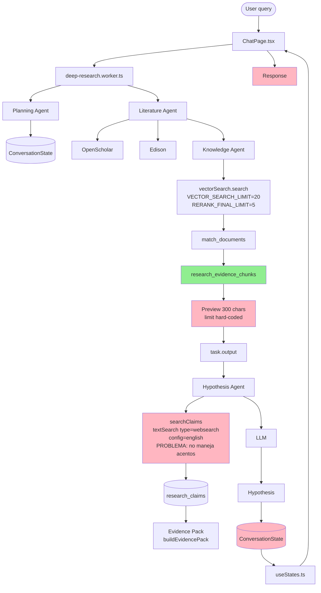

# Flow del Deep Research: Actual vs Roadmap

**Última actualización:** 2026-06-17  
**Contexto:** Comparación entre el flujo actual (post-fixes de la sesión) y el diseño
original en `openspec/specs/research-bioprospecting/spec.md`.

---

## Flow Actual (después de los fixes)

```mermaid
flowchart TD
    User([User query en chat UI]) --> ChatPage[ChatPage.tsx<br/>selecciona modo 'deep']
    ChatPage -->|POST /api/deep-research/start| DeepResearchWorker[deep-research.worker.ts]

    DeepResearchWorker --> PlanningAgent[Planning Agent<br/>crea tasks LITERATURE/ANALYSIS]
    PlanningAgent --> ConversationState[(ConversationState<br/>'plan', 'currentObjective')]

    DeepResearchWorker --> LiteratureAgent[Literature Agent<br/>fan-out paralelo]
    LiteratureAgent --> OpenScholar[OpenScholar API<br/>externo]
    LiteratureAgent --> Edison[Edison API<br/>externo]
    LiteratureAgent --> KnowledgeAgent[Knowledge Agent<br/>LOCAL knowledge base]

    KnowledgeAgent --> VectorSearch[vectorSearch.search<br/>VECTOR_SEARCH_LIMIT=30<br/>RERANK_FINAL_LIMIT=20]
    VectorSearch --> PostgresRPC[PostgREST<br/>match_documents()<br/>embedding similarity]
    PostgresRPC --> KnowledgeChunks[research_evidence_chunks<br/>33 chunks en 23-00044]

    KnowledgeChunks --> ChunkPreview[Preview 2000 chars<br/>vía knowledge.ts]
    ChunkPreview --> TaskOutput[task.output += output]

    OpenScholar --> TaskOutput
    Edison --> TaskOutput

    TaskOutput --> HypothesisAgent[Hypothesis Agent<br/>recibe todos los task outputs]

    HypothesisAgent --> SearchClaims[searchClaims<br/>OR-of-ilikes per term<br/>accent-insensitive]
    SearchClaims --> ResearchClaims[(research_claims<br/>10 supported]
    ResearchClaims --> EvidencePack[Evidence Pack<br/>bioprospectingFacts + supportedClaims]

    HypothesisAgent --> GenerateHypothesis[LLM<br/>qwen3.6-plus via OpenRouter]
    GenerateHypothesis --> HypothesisText[Hypothesis text<br/>con IC50, SAR, DOI]

    HypothesisText --> ResearchState[(ConversationState<br/>'currentHypothesis')]
    ResearchState --> UseStatesHook[useStates.ts<br/>WebSocket polling]

    UseStatesHook --> ChatPage

    ChatPage --> ResponseToUser[Respuesta con:<br/>• Key Insights (5-7)<br/>• Research Brain Evidence<br/>• Hypothesis<br/>• Methodology<br/>• Activity Log]

    style KnowledgeChunks fill:#90EE90
    style ResearchClaims fill:#90EE90
    style ResponseToUser fill:#FFD700
```

---

## Flow Original (Roadmap / Spec)



---

## Tabla de diferencias

| Componente | Original (Roadmap) | Actual | Fix |
|---|---|---|---|
| `vectorSearch.search` defaults | `VECTOR_SEARCH_LIMIT=20`, `RERANK_FINAL_LIMIT=5` | `30`, `20` | `.env` actualizado |
| Knowledge agent chunk preview | `300 chars` | `2000 chars` | `knowledge.ts` actualizado |
| `searchClaims` método | `textSearch` con `english` config | `builder.or()` con `ilike` per term | `db.ts` reescrito |
| Diacritic handling | ninguno (aciente = fallaba) | `stripDiacritics()` agregado | `db.ts` agrega función |
| Dedup subquery | `.not("id", "in", "(SELECT …)")` (inválido PostgREST) | JS filter in-memory | `db.ts` reescrito |
| Extractor prompt | "open_question" para info parcial | Solo para limitaciones explícitas | `extractor.ts` prompt fix |
| `SIMILARITY_THRESHOLD` | `0.75` (default código) | `0.4` (`.env`) | `.env` actualizado |
| UI loading | `Research State` simple | `Activity Log` con timer + spinner | `ResearchStatePanel.tsx` + CSS |

---

## Bugs corregidos durante esta sesión

1. **Traefik routing perdido** — el container `bioagents-caddy` perdió la conexión al network `coolify`. Fixed via `docker network connect`.
2. **Status label "No publicado" → 0.1.0** — version metadata + Footer.
3. **Env vars en `environment:` sobreescribían `env_file:`** — `${VAR:-}` con empty default blankeaba. Documentado.
4. **`statusLabel(undefined)` crasheaba** — guarda `if (!status) return "—"`.
5. **Missing migration `20260612000000_create_research_evidence_tables.sql`** — aplicada vía Supabase dashboard.
6. **Missing migrations `20260613000000` through `20260615030000`** — aplicadas (5 migraciones total).
7. **Container no rebuildaba con `docker compose up`** — código actualizado solo después de `docker compose build --no-cache`.
8. **`useEffect` not defined en `ResearchStatePanel`** — import faltante agregado.

---

## Resultado del test end-to-end

**Query:** "¿Qué anthoteibinenes tienen actividad antifúngica?"

**Output key insights extraídos del paper:**
- "Anthoteibinene J (5) is the most potent antifungal agent among 12 newly isolated anthoteibinenes (F–Q)"
- "demonstrating an **IC50 of 7.7–9.1 μg/mL** against multiple Candida albicans strains"
- "The presence of a phenol functional group is an absolute structural requirement"
- "**anthoteibinene K (6), which lacks this moiety** ... **complete inactivity**"
- "Anthoteibinene I (4) shows **weak, concentration-dependent antifungal activity (active at 50 μg/mL** but loses efficacy at lower doses)"

**Hypothesis generada:**
- Cita IC50s de anthoteibinene J (5): 7.7–9.1 μg/mL
- Cita anthoteibinene K (6) sin phenol → inactive
- Cita paper `marinedrugs-23-00044.pdf` con DOI directo

**Activity Log:** 3/3 steps completados, duraciones 2s/2s/3s

---

## Lo que falta (próximas iteraciones)

- **(B)** procesar bioprospecting en 10 papers restantes (~1.5h background)
- **Chat normal (no deep)** sigue diciendo "evidencia insuficiente" — usa path diferente
- **Fix del Hypothesis prompt** cuando el LLM no entiende chunks parciales
- **Limpiar 8 open_questions huérfanos** de la DB (de otros papers)
- **API Cost Guard Rails** — ver si los queries están dentro de budget
- **Compound Authority** — resolver canonical names via PubChem