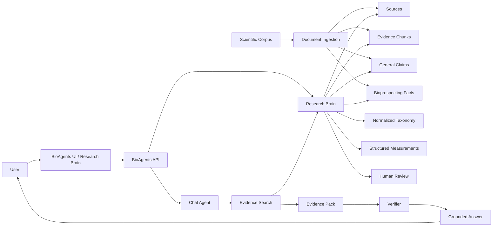
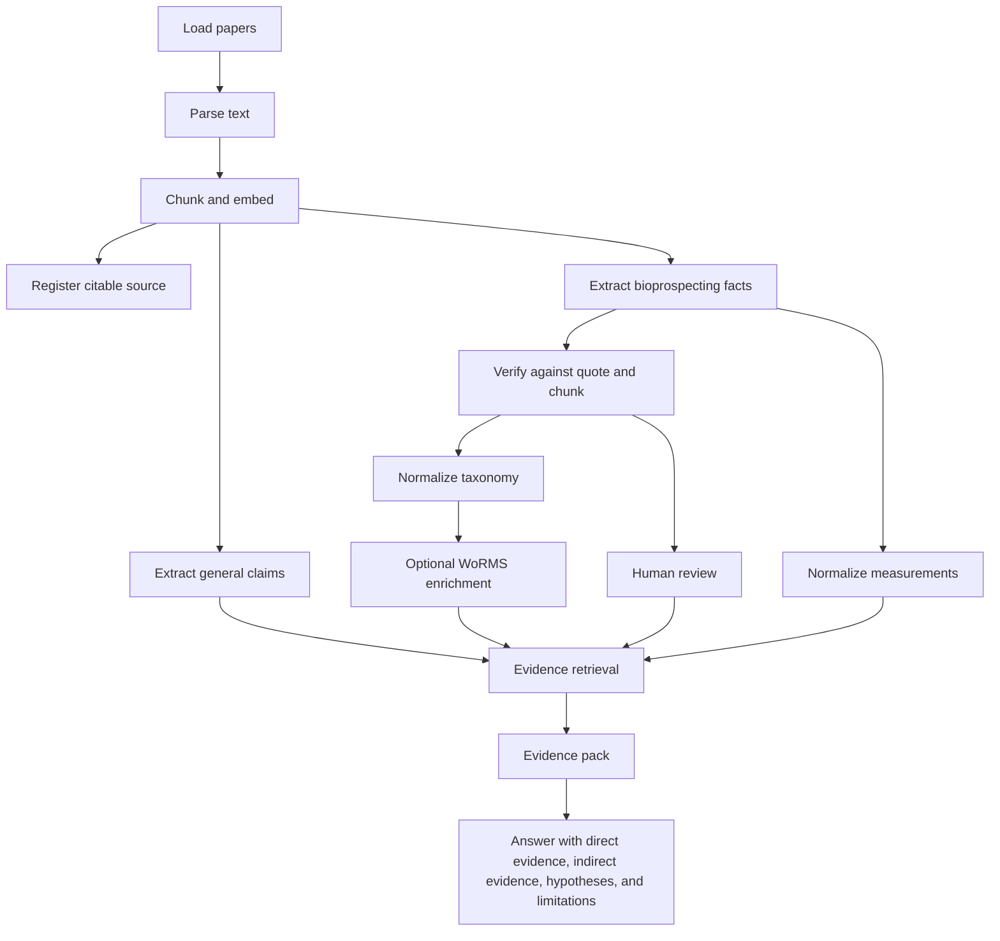
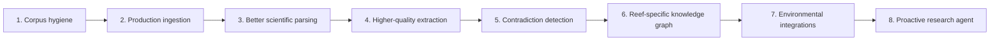

# BioAgents Bioprospection Overview

BioAgents is being shaped into an evidence-first agent for marine bioprospection. It ingests scientific papers, extracts source-grounded facts, normalizes biological entities, and answers questions with direct quotes, source links, evidence labels, and explicit uncertainty.

The full Spanish project document lives in `documentation/docs/BIOAGENTS_PROJECT_OVERVIEW.md`.

## Product Goal

Build a system that can answer questions like:

- What can be explored from this species in my region?
- Which coral reef organisms show anticancer, anti-inflammatory, antimicrobial, cosmetic, biomaterial, or thermal-resistance leads?
- Is there direct evidence for this species, or only indirect evidence from the same genus/family/ecosystem?
- Which sources support, contradict, or fail to support a scientific claim?

The core rule is:

> No scientific factual claim should be presented as established without traceable evidence.

## Current Architecture

## Evidence Workflow

## Implemented State

- Incremental corpus ingestion with dry-run.
- Research Brain schema for sources, chunks, claims, graph edges, bioprospecting facts, taxa, aliases, measurements, and review status.
- Structured bioprospecting extraction for species, genus, family, compound, bioactivity, assay/model, application, result summary, quote, confidence, and status.
- Evidence pack retrieval used by the chat agent.
- Answer-time rules that force the agent to distinguish direct evidence, same-genus evidence, same-family evidence, compound/activity matches, ecological analogy, weak keyword matches, and no-evidence cases.
- `/brain` UI for evidence search, source inspection, review notes, entity correction, and bulk review actions.
- Taxonomy normalization with local canonical taxa and optional WoRMS Aphia IDs.
- Structured measurement fields and conservative numeric backfill.
- Docker deployment validated locally at `http://100.121.211.121:3000/api/health`.

## Current Test Corpus

The current test corpus has two scientific PDFs. The system has already been used to validate the end-to-end flow:

- ingestion
- bioprospecting extraction
- evidence search
- taxonomy normalization
- WoRMS enrichment
- UI review
- chat grounding

Taxa verified in the current sample:

- `Acropora`: WoRMS AphiaID `205469`
- `Acropora aspera`: WoRMS AphiaID `207011`
- `Symbiodinium`: WoRMS AphiaID `109572`

## Main Gaps

- Large-corpus worker pool for the future 60GB paper set.
- Better PDF parsing for page numbers, captions, tables, scanned PDFs, and OCR.
- Automated contradiction detection.
- Stronger extraction of quantitative statistics and uncertainty.
- Dashboard for corpus operations: pending, processed, failed, retried, skipped, cost, and latency.
- External integrations beyond WoRMS, such as GBIF, NCBI Taxonomy, environmental reef data, and grey literature sources.

## Future Roadmap

High-impact future features:

- 60GB ingestion dashboard.
- Worker pool with queue backpressure and resumable runs.
- Semantic deduplication of papers and source versions.
- Contradiction detector across facts.
- Evidence review queue for scientists.
- Extended taxonomy authority layer: WoRMS, GBIF, and NCBI.
- Table and figure-caption extraction.
- Corpus quality scoring.
- Species/genus comparison matrix.
- Reef-aware environmental data integrations.

## Success Criteria

Scientific:

- Every strong claim has a source, fragment, and quote.
- Direct evidence and indirect evidence are never mixed.
- Hypotheses are labeled as hypotheses.
- Human-reviewed facts are prioritized.
- Incorrect or quarantined facts are excluded from normal answers.

Technical:

- Ingestion can resume after failure.
- Duplicate sources are skipped.
- Search works by normalized taxonomy before plain text matching.
- Docker deployment stays stable.
- The method can scale from two papers to thousands without changing the evidence rules.

Product:

- A non-technical researcher can review evidence in the UI.
- The agent explains why it knows something.
- The agent also explains when it does not know something.
- The system generates research leads without inventing scientific claims.
