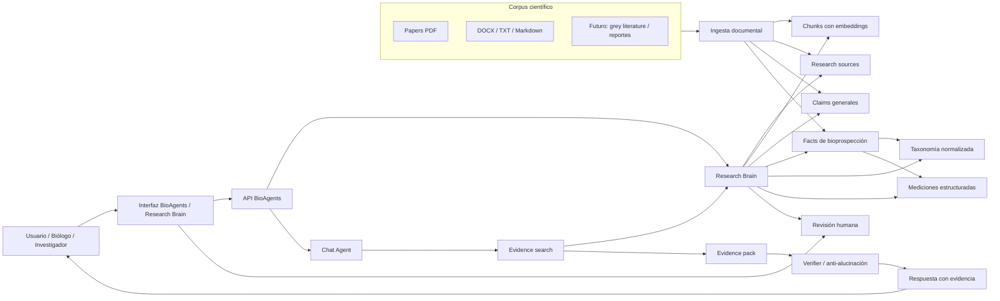
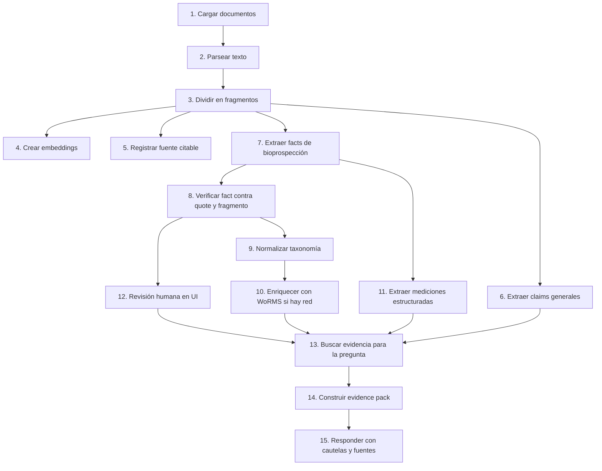
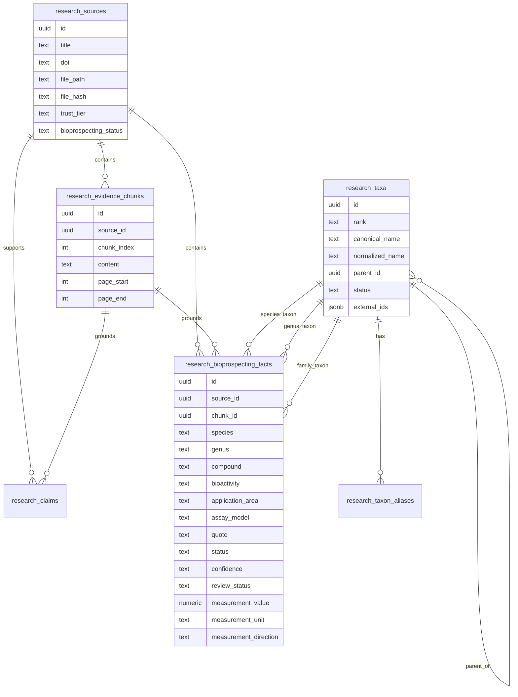
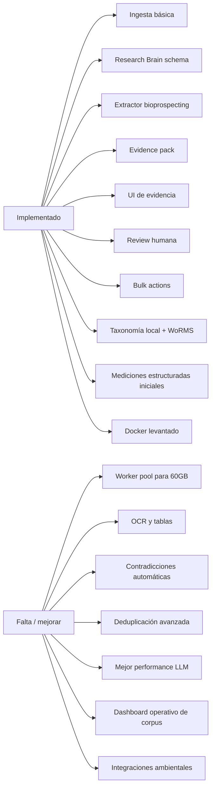
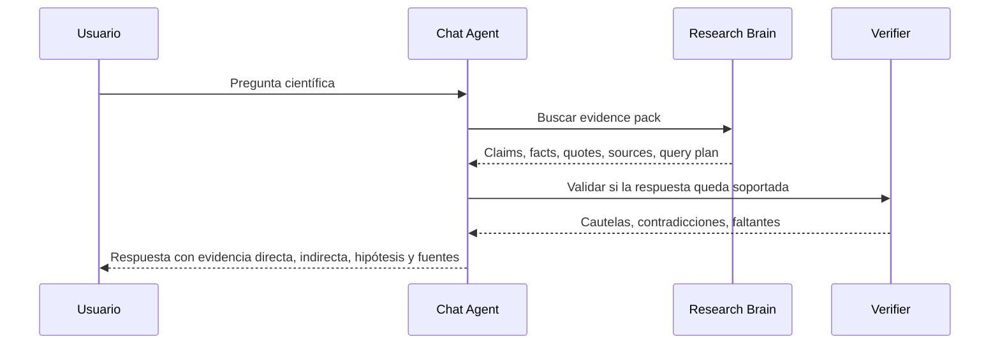
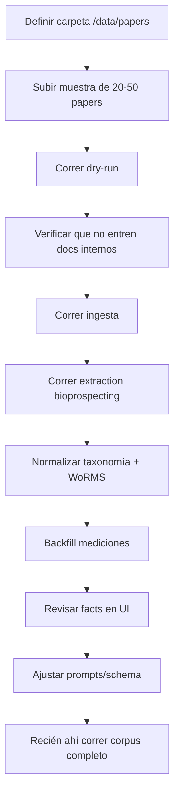

# BioAgents Project Overview

Fecha de estado: 2026-06-07

## Resumen

BioAgents es un agente de bioprospección marina orientado a descubrir oportunidades científicas a partir de bibliografía privada y fuentes verificables. El objetivo no es que el agente "imagine" respuestas, sino que funcione como un motor de evidencia: ingiere papers, extrae hechos científicos atómicos, guarda citas y fragmentos, normaliza entidades biológicas, y responde separando evidencia directa, evidencia indirecta, hipótesis y vacíos de investigación.

El caso inicial es bioprospección en organismos marinos y arrecifes: especies, géneros, biomoléculas, metabolitos, bioactividades, aplicaciones anticancerígenas, antiinflamatorias, cosméticas, antimicrobianas, biomateriales, resistencia térmica y restauración coralina.

La regla central del proyecto es:

> Ningún claim científico debe presentarse como establecido si no tiene evidencia trazable.

Esto no garantiza "verdad absoluta". Garantiza que cada afirmación científica fuerte tenga una ruta auditable hacia una fuente, un fragmento y una cita.

## Visión Del Producto

Un usuario debería poder preguntar:

- "Tengo esta especie en mi región, ¿qué exploraciones biotecnológicas puedo investigar?"
- "¿Qué precursores anticancerígenos aparecen en arrecifes de coral?"
- "¿Hay evidencia de resistencia al calor en este género?"
- "¿Qué biomoléculas aparecen en una anémona africana y en taxones similares de otra región?"
- "¿Qué papers cargados apoyan esta hipótesis y cuáles la contradicen?"

Y el sistema debería responder:

- qué evidencia directa existe
- qué evidencia indirecta existe por género, familia, compuesto, bioactividad o ecosistema
- qué oportunidades son solamente hipótesis
- qué limitaciones o contradicciones hay
- qué fuente, DOI, fragmento, quote y estado de revisión soporta cada claim

## Arquitectura General

## Flujo Evidence-First

## Modelo De Datos Actual

## Qué Está Implementado

### Ingesta y Corpus

- Ingesta incremental de documentos con `bun run ingest:docs`.
- Dry-run de ingesta para ver qué se procesaría antes de cargar documentos.
- Registro de fuentes en `research_sources`.
- Dedupe por path, título y hash de archivo.
- Soporte de PDF, Markdown, DOCX y TXT.
- Separación recomendada entre corpus científico e documentación interna.

### Research Brain

- Tablas para fuentes, fragmentos, claims, facts, taxonomía, aliases y estado de revisión.
- Evidence chunks con fragmento y source link.
- Claims generales y facts estructurados de bioprospección.
- Búsqueda de evidencia integrada al chat.
- Evidence pack usado como primera fuente de verdad del agente.

### Extracción De Bioprospección

El extractor intenta guardar:

- especie, género, familia y grupo orgánico
- geografía y ecosistema
- parte del organismo o material
- compuesto, clase y tipo molecular
- bioactividad y aplicación
- ensayo/modelo experimental
- resultado resumido
- quote textual y chunk
- estado, confianza y tipo de evidencia

### Mediciones Estructuradas

Ya existen campos para resultados cuantitativos:

- `measurement_value`
- `measurement_unit`
- `measurement_direction`
- `measurement_min`
- `measurement_max`
- `timepoint`
- `condition`
- `p_value`
- `sample_size`
- `statistical_test`

También existe backfill conservador con `bun run normalize:measurements`.

### Taxonomía

- Normalización local en `research_taxa`.
- Aliases en `research_taxon_aliases`.
- Links desde facts hacia species/genus/family taxon IDs.
- Derivación automática de género cuando el fact trae especie pero no género.
- Enriquecimiento opcional con WoRMS mediante `bun run normalize:taxonomy -- --worms`.
- Almacenamiento de AphiaID, valid AphiaID, LSID, URL, autoridad, status y nombre aceptado.
- Selector conservador que prioriza registros WoRMS aceptados cuando hay homónimos o resultados ambiguos.

### UI Research Brain

- Vista `/brain`.
- Tab de búsqueda de evidencia.
- Filtros por fuente, trust tier, review status y otros campos.
- Cards de evidencia con quote, source y clasificación.
- Panel de query plan.
- Acciones de revisión por fact:
  - verified
  - needs_review
  - incorrect
  - quarantined
- Notas de revisión.
- Correcciones de entidades.
- Acciones bulk sobre facts seleccionados con nota compartida.
- Los facts `incorrect` y `quarantined` se excluyen de retrieval normal.

### Chat Agent

- Usa `research_brain_search` antes de afirmar claims científicos.
- Distingue evidencia directa, mismo género, misma familia, analogía ecológica, match por compuesto/actividad y keyword débil.
- Si no hay evidencia suficiente, debe decir que los papers cargados no alcanzan para sostener el claim.
- Incluye fuente, DOI o link interno, fragmento y quote/snippet cuando responde con evidencia.

## Estado Actual Del Proyecto

### Validación Con Corpus De Ejemplo

Estado probado con 2 documentos científicos de ejemplo:

- El pipeline funciona end to end.
- Se extrajeron facts de bioprospección desde papers de coral/metabolómica/microbioma.
- Se normalizó taxonomía para facts con `Acropora aspera`, `Acropora` y `Symbiodinium`.
- WoRMS resolvió los taxones principales con AphiaIDs aceptados:
  - `Acropora`: AphiaID `205469`
  - `Acropora aspera`: AphiaID `207011`
  - `Symbiodinium`: AphiaID `109572`
- Docker quedó levantado y validado en `http://100.121.211.121:3000/api/health`.

### Limitaciones Actuales

- El corpus actual es mínimo; todavía no representa el comportamiento con 60GB.
- La extracción LLM puede ser lenta: en pruebas anteriores algunos batches tardaron 90-110 segundos.
- La lectura PDF todavía no preserva siempre layout, páginas, tablas o captions con fidelidad ideal.
- La contradicción entre facts existe como concepto, pero falta detección automática robusta.
- La medición estructurada existe, pero necesita extracción más profunda de rangos, unidades, estadística, p-values y condiciones.
- Todavía no hay worker pool real para procesar muchos PDFs en paralelo con backpressure.
- Falta una pantalla operativa para ver progreso global del corpus: procesados, fallidos, pendientes, reintentos, costos y tiempos.

## Cómo Responde El Agente

Formato recomendado:

1. Respuesta corta.
2. Evidencia directa.
3. Evidencia indirecta.
4. Hipótesis a testear.
5. Limitaciones y contradicciones.
6. Fuentes usadas.

## Roadmap Futuro

### Etapa 1: Preparación Para 60GB

Objetivo: procesar el corpus grande sin meter basura ni duplicados.

- Carpeta dedicada para papers reales.
- Dry-run obligatorio antes de ingesta.
- Checklist de operador.
- Dedupe avanzada por DOI, título, hash y similitud.
- Clasificación de fuente:
  - peer-reviewed paper
  - review
  - preprint
  - patent
  - database export
  - grey literature
  - internal note

### Etapa 2: Ingesta De Producción

Objetivo: correr en VPS de forma resumible.

- Worker pool de parsing/embedding/extraction.
- Cola con backpressure.
- Reintentos por documento.
- Resume desde pending/failed.
- Dashboard de estado.
- Métricas de costo, tiempo y throughput.

### Etapa 3: Parsing Científico Mejorado

Objetivo: aumentar fidelidad de fuente.

- Page numbers por chunk.
- Extracción separada de tablas.
- Captions separadas.
- Detección de referencias para no tratarlas como resultados primarios.
- Detección de PDFs escaneados.
- OCR cuando haga falta.

### Etapa 4: Extracción Más Científica

Objetivo: facts más precisos y comparables.

- Extractores especializados:
  - taxonomía
  - compuestos
  - bioactividad
  - assays
  - aplicaciones
  - limitaciones
  - contradicciones
- Mejor schema de incertidumbre.
- Estructura de condiciones experimentales.
- Mejor captura de estadística: n, p-value, test, rango, error.

### Etapa 5: Contradicciones

Objetivo: detectar evidencia conflictiva.

- Comparar facts con misma especie + compuesto + bioactividad.
- Marcar resultados opuestos.
- Detectar divergencias cuantitativas fuertes.
- LLM-as-judge para pares conflictivos.
- UI para revisar contradicciones.

### Etapa 6: Agente De Arrecifes

Objetivo: diferenciar BioAgents como sistema especializado en arrecifes.

- Knowledge graph coralino:
  - eventos de bleaching
  - clados Symbiodiniaceae
  - enfermedades coralinas
  - restauración
  - viveros de coral
  - genotipos
  - tasas de crecimiento
- Integraciones ambientales:
  - temperatura superficial del mar
  - alertas de bleaching
  - ocurrencias de especies
  - datos de monitoreo de arrecifes
- Módulo de assisted evolution:
  - selección artificial
  - linajes parentales
  - ensayos de tolerancia térmica
  - comparación assisted vs wild type

## Diez Features Futuras Recomendadas

1. **Dashboard de ingesta 60GB**: progreso, fallos, reintentos, costos y velocidad.
2. **Deduplicación semántica de papers**: detectar versiones duplicadas por DOI, título y similitud textual.
3. **Contradiction detector**: alertar cuando dos papers sostienen resultados incompatibles.
4. **Evidence review queue**: bandeja de curación para científicos, priorizada por baja confianza o alto impacto.
5. **Taxonomy authority layer ampliada**: WoRMS + GBIF + NCBI, con IDs externos en el mismo patrón.
6. **Extractor de tablas y captions**: separar resultados tabulares de texto narrativo.
7. **Corpus quality score**: puntaje por fuente según peer review, DOI, tipo de estudio, tamaño de muestra y revisión humana.
8. **Comparador de especies/géneros**: matriz de compuestos, bioactividades, assays y evidencia directa/indirecta.
9. **Alertas proactivas**: nuevos papers, cambios de evidencia, contradicciones nuevas y oportunidades emergentes.
10. **Integración ambiental reef-aware**: cruzar literatura con temperatura, bleaching alerts, ocurrencias y monitoreo local.

## Preparación Para VPS

Antes de comprar o cargar el corpus grande:

Checklist mínimo:

- La carpeta de corpus contiene solo fuentes científicas.
- El dry-run lista lo esperado.
- Los duplicados se saltan.
- La ingesta puede reanudarse.
- Los fallos quedan registrados.
- Las respuestas del chat citan fuentes.
- Los facts incorrectos pueden quarantinarse.
- La UI permite revisar y corregir.
- La taxonomía se normaliza antes de comparar especies.
- El costo/tiempo por batch está medido con una muestra real.

## Criterios De Éxito

### Científicos

- Cada claim fuerte tiene fuente y quote.
- El sistema distingue directo vs indirecto.
- Las hipótesis se etiquetan como hipótesis.
- Los facts revisados por humanos tienen prioridad.
- Los facts incorrectos no llegan a respuestas normales.

### Técnicos

- El corpus se procesa sin duplicar archivos.
- Una corrida fallida se puede reanudar.
- La búsqueda encuentra evidencia por taxonomía normalizada.
- La API responde estable en Docker.
- El sistema escala de 2 papers a miles sin cambiar el método.

### Producto

- Un usuario no técnico puede revisar evidencia.
- El agente explica por qué sabe algo.
- El agente explica cuando no sabe algo.
- La plataforma genera leads de investigación, no claims inventados.

## Estado En Una Frase

BioAgents ya tiene la base evidence-first funcionando: ingesta, extracción, búsqueda, UI de revisión, acciones bulk, normalización taxonómica con WoRMS y grounding del chat. Lo que falta para la próxima etapa es convertir esa base en un pipeline productivo para corpus grande, con workers, dashboard operativo, mejor parsing científico, contradicciones automáticas y curación científica escalable.
